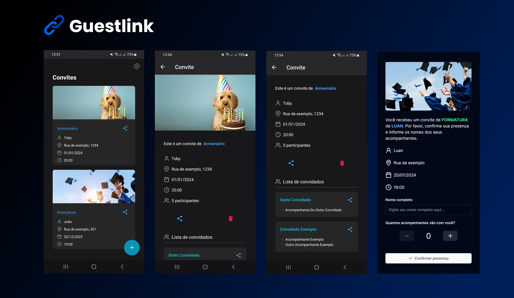

    
    Guestlink

---

> Guestlink é um aplicativo de criação e gerenciamento de convites para eventos.

O aplicativo Guestlink oferece uma solução completa para a gestão de convites de eventos. Com ele, é possível criar convites personalizados, compartilhar um link exclusivo com os convidados e controlar a lista de convidados de forma eficiente. Organizar eventos torna-se uma tarefa mais fácil ao utilizar o Guestlink.

# 📥 Download

    
    

## 🤝 Contribuindo

Pull requests são sempre bem-vindos 😄.

Consulte a documentação do GitHub em [como criar uma solicitação pull](https://help.github.com/en/github/collaborating-with-issues-and-pull-requests/creating-a-pull-request).

## 📝 Licença

Esse projeto está sob licença. Veja o arquivo [LICENÇA](LICENSE) para mais detalhes.

[⬆ Voltar ao topo](#guestlink)